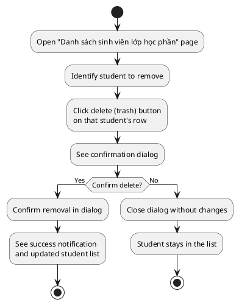
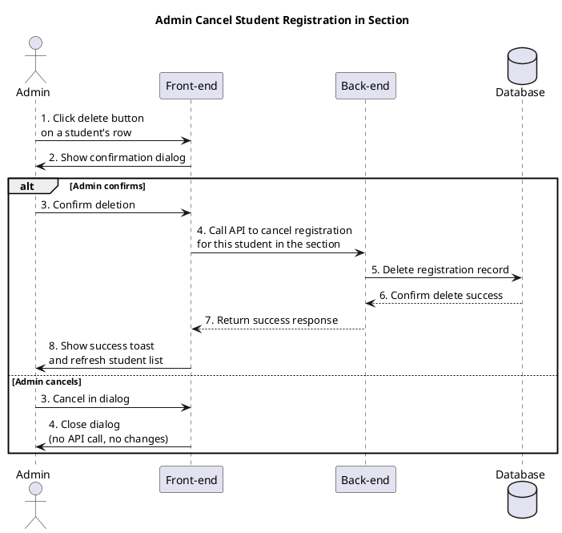

a) Actor:  
- User (admin).

b) Description:  
- This use case allows an admin to cancel a student's registration in a specific class group (course section) from the "Danh sách sinh viên lớp học phần" page.

c) Pre-conditions:  
- The admin is already logged into the system.  
- The admin has opened the "Danh sách sinh viên lớp học phần" page for a specific section.  
- The list of students in that section is already loaded and visible.  

d) Main event flow (admin cancels a student's registration):  
1. The admin identifies the student to be removed from the list of students in the class group.  
2. The admin clicks the delete button (trash icon) on that student's row.  
3. The system opens a confirmation dialog asking the admin to confirm the removal of this student from the class group.  
4. The admin confirms the action in the dialog.  
5. The front-end sends a request to the back-end to cancel this student's registration from the section.  
6. The back-end deletes the registration record for this student and section from the database and returns success.  
7. The front-end shows a success toast (for example, "Đã xóa sinh viên khỏi lớp học phần").  
8. The front-end refreshes the list of students for the section so that the removed student no longer appears.  
9. The use case ends.  

e) Branch flow A1 – Admin cancels the dialog:  
1. The admin clicks the delete button on a student row.  
2. The confirmation dialog appears.  
3. The admin chooses "Hủy" / Cancel in the dialog.  
4. No API call is made; the student remains in the class group.  
5. The use case ends.  

e) Branch flow A2 – Back-end error when canceling registration:  
1. The admin confirms the deletion in the dialog.  
2. The front-end sends a cancel-registration request to the back-end.  
3. The back-end fails to delete the registration (for example, due to an internal error or business rule).  
4. The back-end returns an error to the front-end.  
5. The front-end shows an error toast (for example, "Không thể xóa sinh viên").  
6. The student remains in the list, and the admin can retry or stop.  
7. The use case ends.  

f) Post-condition:  
- **Success**: the selected student's registration in the class group is canceled, removed from the database, and no longer appears in the list.  
- **Failure/cancel**: if the admin cancels the dialog or the back-end returns an error, the registration remains unchanged.  

=== activity diagram (admin cancel student registration in section)=====

=== sequence diagram (admin cancel student registration in section)====

