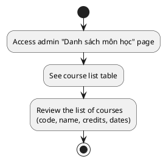
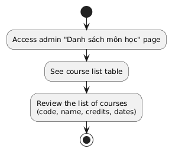
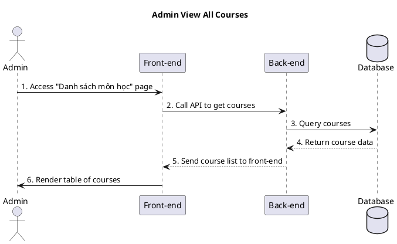
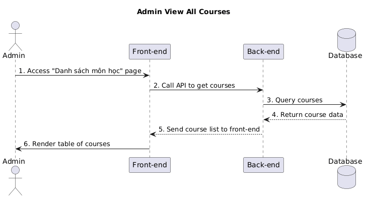

a) Actor:  
- User (admin).

b) Description:  
- This use case allows an admin to open the "Danh sách môn học" page and simply view the list of courses that the system returns from the back-end.

c) Pre-conditions:  
- The admin is already logged into the system.  
- The admin has permission to access the course management/import page.  

d) Main event flow:  
1. The admin accesses the "Danh sách môn học" page (ImportPage).  
2. The system displays the course table including code, name, credits, created date and updated date for each course.  
3. The admin reviews the course list.  
4. The use case ends.  

e) Branch flow A1 – No courses found:  
1. The system finds no courses.  
2. The system shows the message "Không có dữ liệu môn học" in the table.  
3. The use case ends.  

f) Post-condition:  
- The admin has seen the list of courses (or the fact that there are none).

=== activity diagram (admin view all courses)=====

=== activity diagram image====

=== sequence diagram (admin view all courses)====

=== sequence diagram image====

