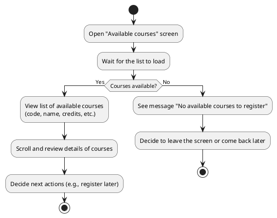
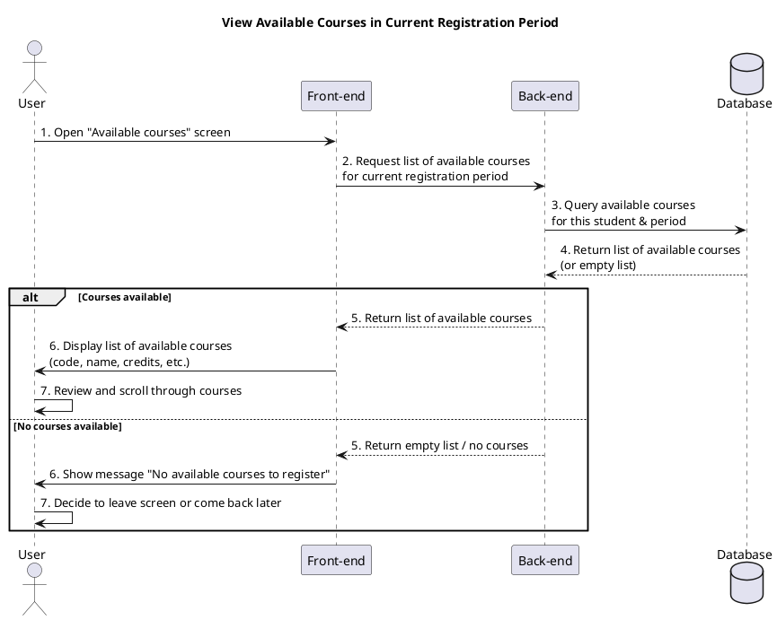

a) Actor:  
- User (student).

b) Description:  
- This use case allows the student to view the list of subjects/courses that are available for registration in the current credit registration period.

c) Pre-conditions:  
- The student is already logged into the system.  
- There is an active registration period configured in the system.  

d) Main event flow:  
1. The student selects the function to view available courses (opens the "Available courses" or credit registration screen).  
2. The system loads and displays the list of available subjects/courses for the current registration period.  
3. The student reviews the list of available courses (code, name, credits, etc.).  
4. The student scrolls, browses, and checks which courses are marked as available.  
5. The use case ends when the student has finished viewing the list (they may later proceed to register in another use case).  

e) Branch flow A1 – No courses available:  
1. The system cannot find any available courses for the current registration period.  
2. The system shows a message that there are no available courses to register at this time.  
3. The student acknowledges the message and may choose to leave the screen.  
4. The use case ends.  

f) Post-condition:  
- The student has seen the list (or the absence) of available courses for the current registration period and can decide what to do next (for example, register for courses in another use case or come back later).

=== activity diagram (view available courses)=====

=== activity diagram image====

=== sequence diagram (view available courses)====

=== sequence diagram image====

