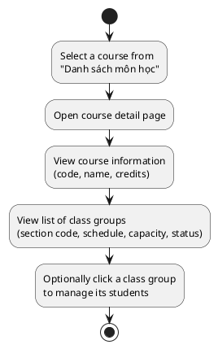
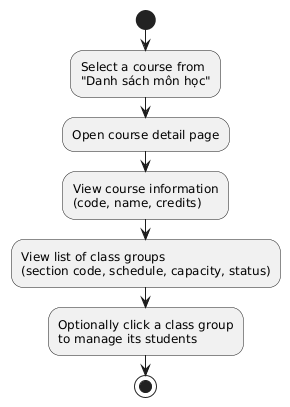
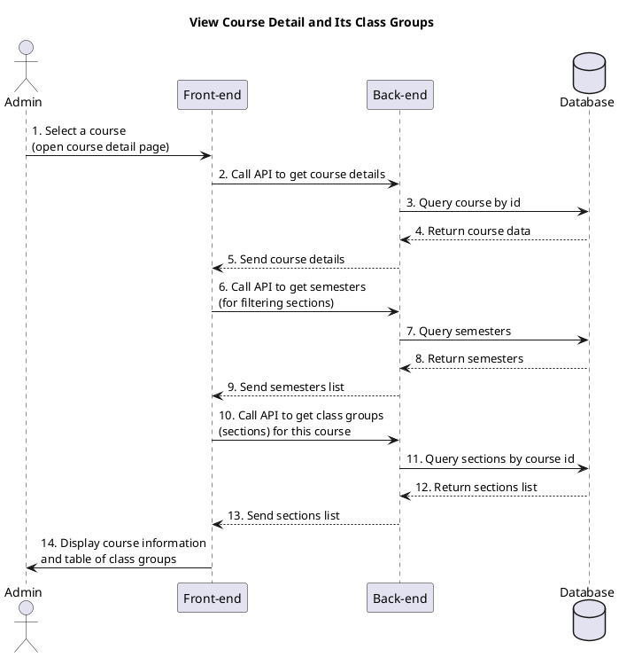
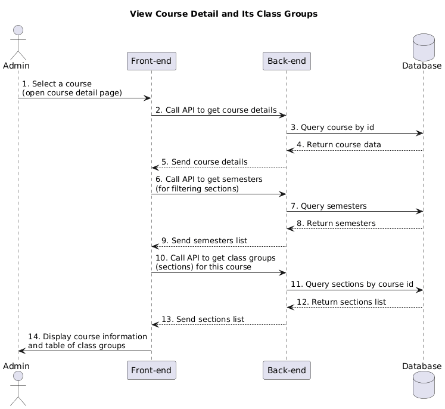

a) Actor:  
- User (admin).

b) Description:  
- This use case allows an admin to open the detail page of a course and see its basic information together with the list of its class groups (course sections).

c) Pre-conditions:  
- The admin is already logged into the system.  
- The admin has access to the courses list and selects a specific course to view details.  

d) Main event flow:  
1. The admin selects a course (for example, clicks on a course in the "Danh sách môn học" page).  
2. The system navigates to the course detail page.  
3. The system displays:  
   - The course information (code, name, credits).  
   - The table of class groups including section code, schedule, capacity, number of registered students, and status.  
4. The admin reviews the course details and its class groups.  
5. The admin may click on a class group row to navigate to the list of students for that class group.  
6. The use case ends when the admin finishes reviewing the information.  

e) Branch flow A1 – No class groups for this course:  
1. The system finds no class groups for the selected course.  
2. The system shows the message "Chưa có lớp học phần nào" in the table.  
3. The admin understands that no sections exist yet for this course.  
4. The use case ends.  

f) Post-condition:  
- The admin has seen the course's basic information and the list (or absence) of its class groups and can decide further actions, such as managing students in a specific section.

=== activity diagram (view course detail and its sections)=====

=== activity diagram image====

=== sequence diagram (view course detail and its sections)====

=== sequence diagram image====

