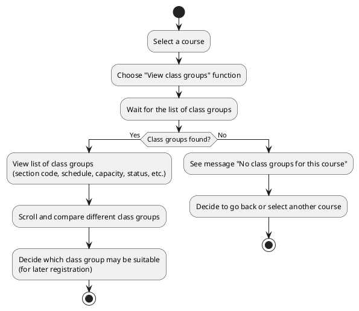
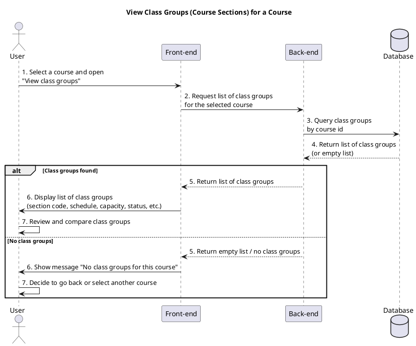

a) Actor:  
- User (student).

b) Description:  
- This use case allows the student to view the list of class groups (course sections) for a specific course in the current registration context.

c) Pre-conditions:  
- The student is already logged into the system.  
- The student has selected or opened a specific course (for example, from the available courses list).  

d) Main event flow:  
1. The student selects a course and chooses the function to view its class groups (course sections).  
2. The system displays the list of class groups for that course (section code, schedule, capacity, registered students, status, etc.).  
3. The student scrolls and reviews the class groups to understand available schedules and capacities.  
4. The student may click on a class group to see more details or prepare for registration in another use case.  
5. The use case ends when the student has finished viewing the list of class groups for that course.  

e) Branch flow A1 – No class groups for the course:  
1. The system does not find any class groups for the selected course.  
2. The system shows a message such as "There are no class groups for this course".  
3. The student acknowledges the message and may go back to the previous screen or choose another course.  
4. The use case ends.  

f) Post-condition:  
- The student has seen the list (or absence) of class groups for the selected course and can decide the next step (e.g., choose another course or proceed to register for a class group in a separate use case).

=== activity diagram (view class groups for a course)=====

=== sequence diagram (view class groups for a course)====

