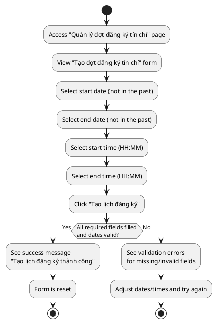
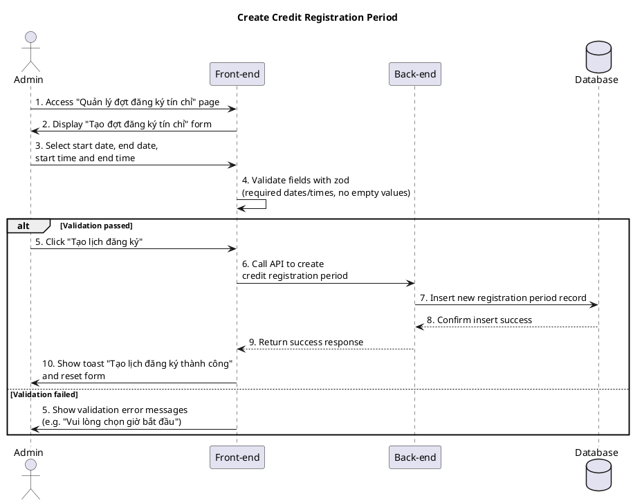

a) Actor:  
- User (admin).

b) Description:  
- This use case allows an admin to create a new credit registration period for students by setting the start and end date & time on the "Quản lý đợt đăng ký tín chỉ" page.

c) Pre-conditions:  
- The admin is already logged into the system with permission to manage registration periods.  

d) Main event flow:  
1. The admin accesses the "Quản lý đợt đăng ký tín chỉ" page.  
2. The system displays the "Tạo đợt đăng ký tín chỉ" form with fields for start date, end date, start time and end time.  
3. The admin selects a **start date** using the calendar (only dates **from today onwards** are allowed; past dates are disabled).  
4. The admin selects an **end date** using the calendar (also only non-past dates are allowed).  
5. The admin selects a **start time** by choosing hour (HH) and minute (MM) from dropdowns (hours 00–23, minutes 00/15/30/45).  
6. The admin selects an **end time** in the same way.  
7. The admin clicks the **"Tạo lịch đăng ký"** button to submit the form.  
8. The front-end combines each date with its time into ISO strings and sends a create registration period request to the back-end.  
9. The back-end creates the registration period record in the database and returns success.  
10. The front-end shows a success toast "Tạo lịch đăng ký thành công" and resets the form.  
11. The use case ends.  

e) Branch flows / validation conditions:  

- **A1 – Missing required time fields**  
  1. The admin does not choose a start time or end time (HH/MM not selected).  
  2. The form validation fails and shows error messages like "Vui lòng chọn giờ bắt đầu." / "Vui lòng chọn giờ kết thúc.".  
  3. The request is not sent to the back-end until all required fields are filled.  

- **A2 – Past dates not allowed**  
  1. The admin tries to pick a past date for start or end date.  
  2. The calendar component prevents selection (past dates are disabled by `isPastDate`), so the admin can only choose today or future dates.  
  3. The admin must adjust the date to a valid value before submitting.  

- **A3 – Back-end error when creating registration period**  
  1. The admin fills all fields correctly and submits, but the back-end returns an error (for example, API or business validation issue).  
  2. The front-end shows an error toast with the message from the back-end (e.g. "Tạo đợt đăng ký tín chỉ thất bại").  
  3. The form remains on screen with the entered values so the admin can adjust and try again.  

f) Post-condition:  
- **Success**: a new credit registration period with start and end date/time is stored in the system and will control when students can register.  
- **Failure/validation**: if validation fails or the back-end returns an error, **no registration period is created**, and the admin stays on the form to correct the data.

=== activity diagram (create credit registration period)=====

=== sequence diagram (create credit registration period)====

