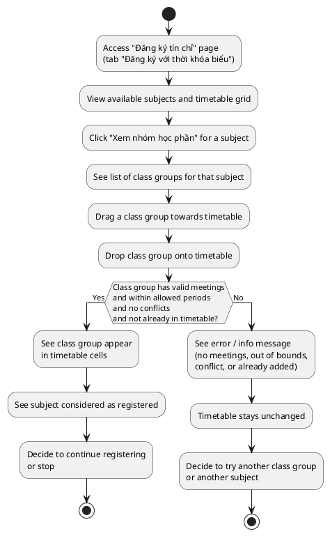
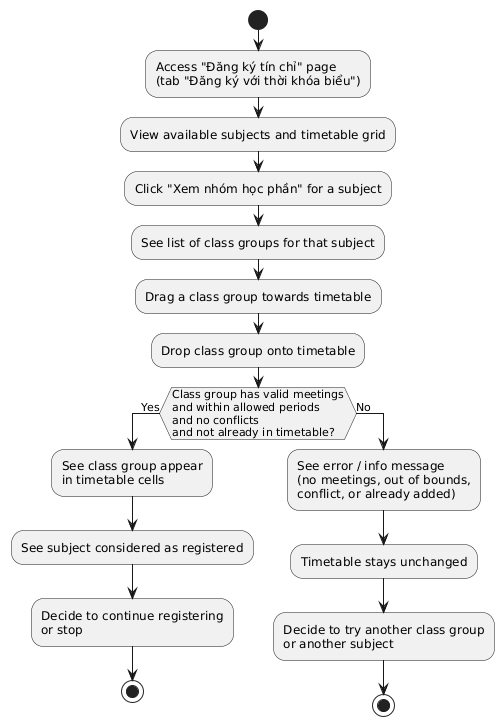
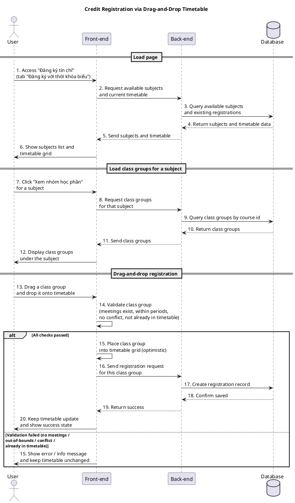
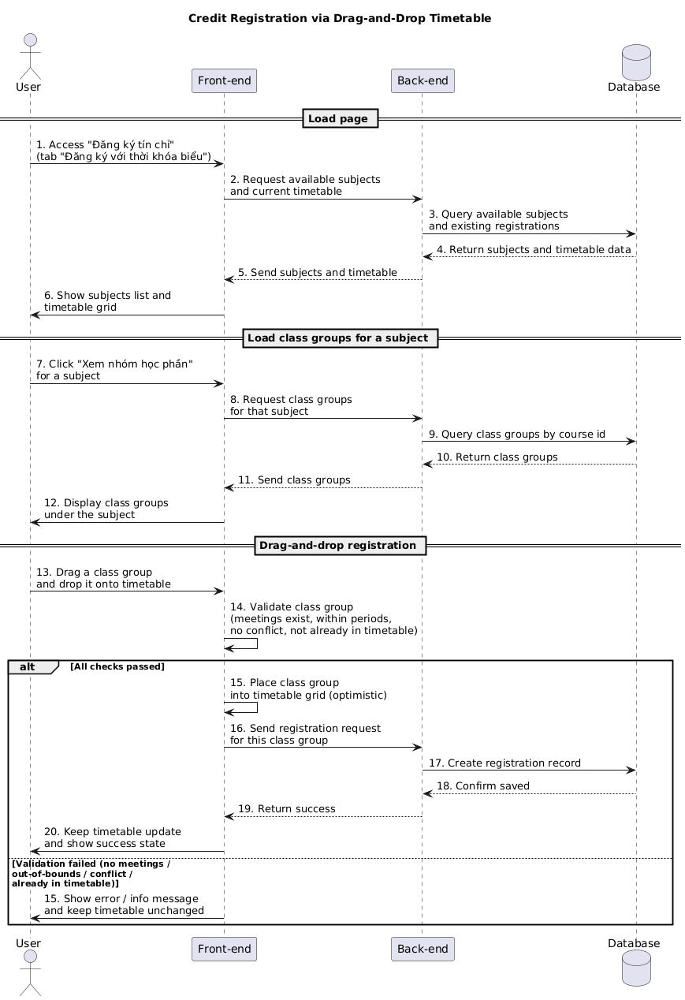

 a) Actor:  
- User (student).

b) Description:  
- This use case allows the student to register for a class group by **dragging a class group (course section) onto the timetable grid** on the "Đăng ký tín chỉ" page (tab "Đăng ký với thời khóa biểu").

c) Pre-conditions:  
- The student is already logged into the system.  
- There is an active credit registration period that allows the student to register.  
- The system has loaded:  
  - The list of available subjects that the student can register.  
  - The student's current timetable (existing registrations) from the server.  

d) Main event flow (register by drag-and-drop):  
1. The student accesses the "Đăng ký tín chỉ" page and switches to the "Đăng ký với thời khóa biểu" tab.  
2. The system displays:  
   - On the left: the list of available subjects, each subject with a button "Xem nhóm học phần".  
   - On the right: the weekly timetable grid (days × periods) with the student's current classes.  
3. The student clicks "Xem nhóm học phần" for a subject.  
4. The system displays the list of class groups (sections) for that subject under the subject card.  
5. The student chooses one class group and starts dragging it towards the timetable grid.  
6. The student drops the class group onto the timetable (any empty cell, used only as a trigger).  
7. The system checks all conditions for that class group:  
   - The class group has valid meeting information (day of week, start period, end period).  
   - All meetings fall within allowed periods (1–10).  
   - There is **no time conflict** with any existing class in the timetable.  
   - The class group is **not already placed** in the timetable.  
8. If all conditions are satisfied, the system places the class group into the timetable at the correct positions (according to its meetings) and adds the subject to the list of registered subjects.  
9. The student sees the class group in the timetable and continues registering other subjects if desired.  
10. The use case ends.  

e) Branch flows / conditions:  

- **A1 – No meetings (no schedule) for the class group**  
  1. The student drags a class group that has no meeting information.  
  2. The system shows an error message like "Lớp học phần này không có lịch học".  
  3. The class group is not placed on the timetable.  

- **A2 – Class group already in timetable**  
  1. The student drags a class group that is already placed in the timetable (same section).  
  2. The system shows an information message such as "Lớp học phần này đã được thêm vào thời khóa biểu".  
  3. The timetable is not changed.  

- **A3 – Meeting out of timetable bounds**  
  1. A meeting of the class group has a period range outside the allowed range (for example, less than 1 or greater than 10).  
  2. The system shows an error message like "Lịch học vượt quá giới hạn: [day] tiết [start-end]".  
  3. The class group is not placed on the timetable.  

- **A4 – Time conflict with existing classes**  
  1. One or more meetings of the dragged class group overlap with existing classes in the timetable.  
  2. The system lists the conflict slots (for example: "Xung đột lịch học tại: T2 tiết 3, T4 tiết 5").  
  3. The system shows an error message with those conflict slots.  
  4. The class group is not placed on the timetable.  

- **A5 – Registration error**  
  1. All checks pass and the class group is placed into the timetable.  
  2. The system fails to register the class group (for example, server error or business rule violation).  
  3. The system reverts the timetable to its previous state and removes the subject from the registered subjects list.  
  4. The system shows an error message such as "Đăng ký lớp học phần thất bại".  

f) Post-condition:  
- **Successful path**:  
  - The student has successfully registered one or more class groups by drag-and-drop.  
  - The timetable reflects the new classes and the registrations are stored in the database.  
- **Error/branch paths**:  
  - If any of the above conditions fail (A1–A5), the system prevents invalid registration and keeps the timetable consistent.

=== activity diagram (credit registration by drag-and-drop)=====

=== activity diagram image====

=== sequence diagram (credit registration by drag-and-drop)====

=== sequence diagram image====

