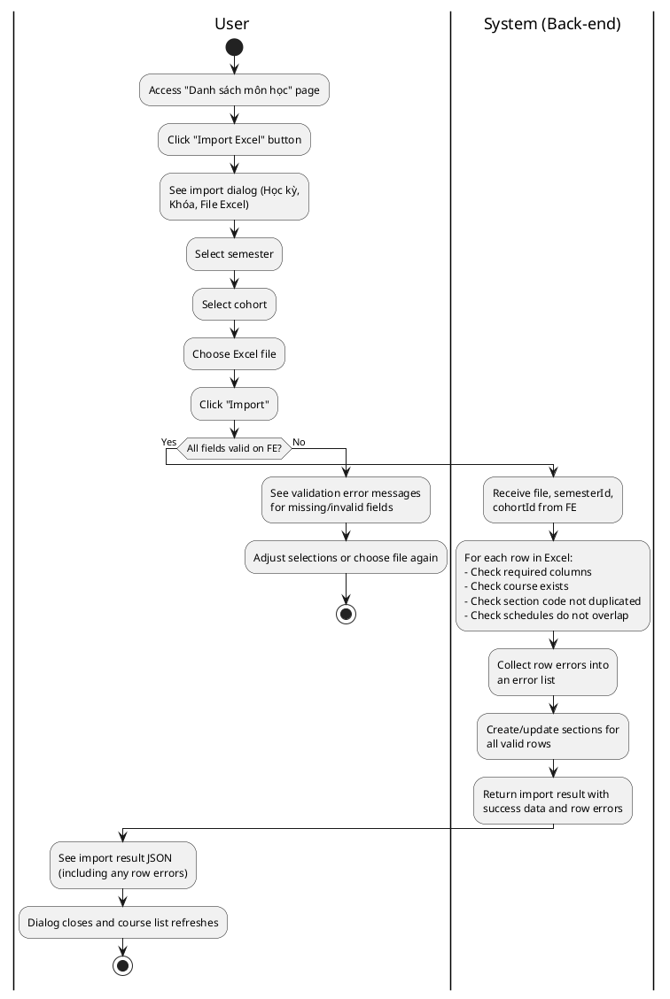
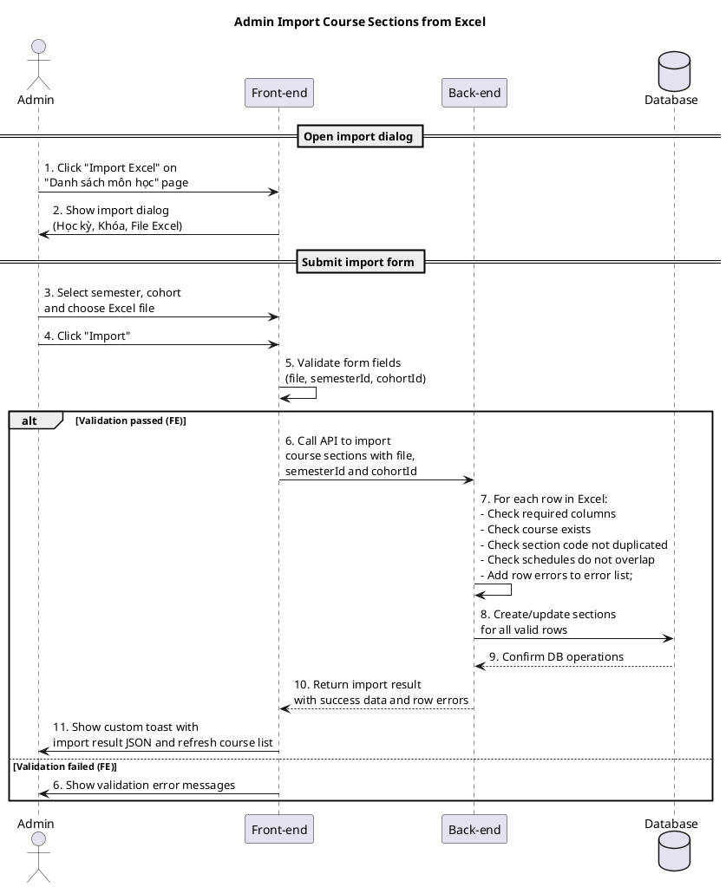
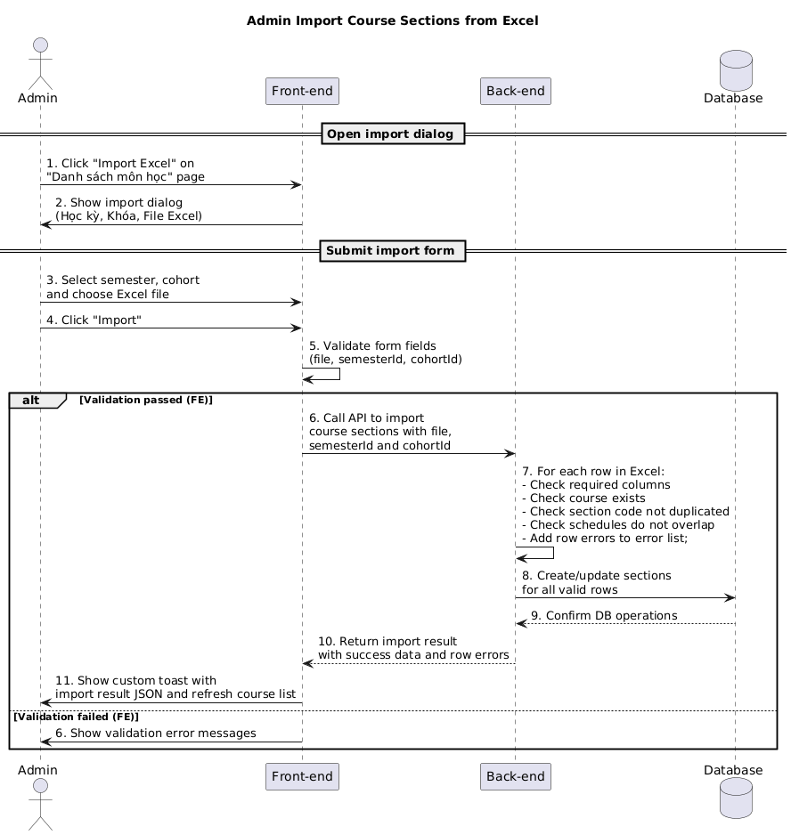

a) Actor:  
- User (admin).

b) Description:  
- This use case allows an admin to import class groups (course sections) for a semester and cohort by uploading an Excel file on the "Danh sách môn học" → "Import Excel" dialog. The back-end will validate each row and report any errors per row.

c) Pre-conditions:  
- The admin is already logged into the system.  
- The admin has permission to access the course management/import page.  

d) Main event flow (import course sections):  
1. The admin opens the "Danh sách môn học" page.  
2. The admin clicks the **"Import Excel"** button to open the import dialog.  
3. The system displays an import form with fields: **Học kỳ**, **Khóa**, and **File Excel**.  
4. The admin selects a semester from the "Học kỳ" dropdown.  
5. The admin selects a cohort from the "Khóa" dropdown.  
6. The admin chooses an Excel file (`.xlsx` or `.xls`) from their computer in the "File Excel" input.  
7. The admin clicks the **"Import"** button to submit the form.  
8. The system validates the form:  
   - A file has been selected.  
   - A valid semester id is selected.  
   - A cohort id is selected.  
9. If validation passes, the system processes the Excel file **row by row**, performing validations such as:  
    - Check that each row has all required columns.  
    - Check whether the referenced course already exists; if not, mark that row as error.  
    - Check whether the section code is duplicated.  
    - Check that, for a section with multiple schedule rows, the schedules do not overlap with each other.  
    - For any row that fails validation, add an error entry into an error array; for valid rows, create/update course sections.  
10. The system shows an import result including information about successful rows and an array of rows with errors and their messages.  
11. The form is reset, the dialog is closed, and the course list is refreshed.  
12. The use case ends.  

e) Branch flows / validation conditions:  

- **A1 – Missing or invalid form fields**  
  1. The admin submits the form without choosing a file, semester, or cohort.  
  2. The system shows error messages such as "Vui lòng chọn file", "Vui lòng chọn học kỳ", "Vui lòng chọn khóa".  
  3. The admin must fill all required fields before submitting.  

- **A2 – Per-row validation errors in Excel**  
  1. The admin submits a valid form and the system starts processing rows.  
  2. For some rows, the system detects problems such as: missing required columns, course not existing, duplicated section code, or overlapping schedules within the same section.  
  3. The system collects these row errors (with row index and error message) into an error array.  
  4. The system displays this error array in the import result so the admin can see which rows failed and why.  
  5. Valid rows may still be imported successfully.  

- **A3 – System error during import (global failure)**  
  1. The admin submits a valid form, but the system fails to process the Excel file entirely (e.g. wrong format, server error).  
  2. The system returns an error message instead of a structured import result.  
  3. The system shows an error notification with that message.  
  4. The dialog remains open with the current selections so the admin can fix and retry.  

f) Post-condition:  
- **Success**: course sections from all valid rows of the Excel file are imported into the system for the chosen semester and cohort; the import result also tells the admin which rows (if any) failed validation.  
- **Failure/validation**: if front-end validation fails or the back-end reports a global error, no rows are imported; if only some rows fail per-row validation, only the valid rows are imported while the admin is informed about the invalid rows.

=== activity diagram (admin import course sections)=====

=== activity diagram image====

=== sequence diagram (admin import course sections)====

=== sequence diagram image====

