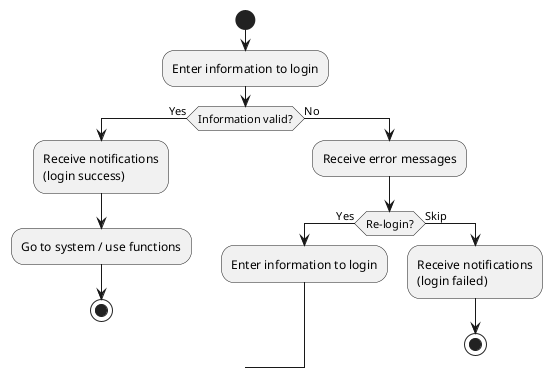
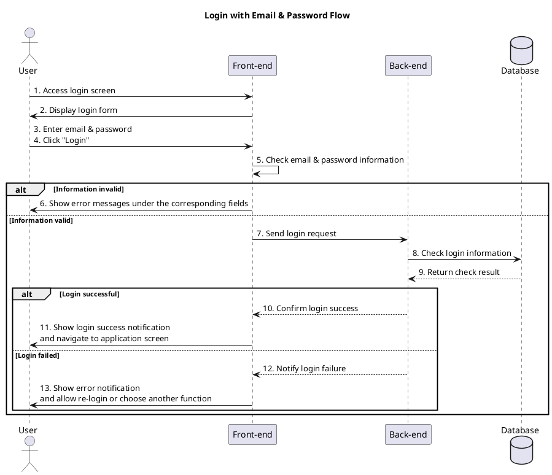

a) Actor:  
- User (student, admin).

b) Description:  
- This use case allows the user to log into the system with email and password in order to use the application's functions.

c) Pre-conditions:  
- The user has not yet logged into the system.  

d) Main event flow:  
1. The user selects the login function.  
2. The system displays the login form (email, password, login button).  
3. The user enters email and password into the login form.  
4. The system checks the email and password information.  
5. If the information is valid, the system confirms the user has logged in successfully.  
6. The user can use the application's functions according to their role.  
7. The use case ends.  

e) Branch flow A1:  
- The user logs in unsuccessfully.  
1. The system notifies that the login process was unsuccessful.  
2. The system allows the user to choose: register (if they do not have an account) or re-enter email/password to log in again.  
3. If the user chooses to log in again, return to step 2 of the main event flow.  
4. If the user does not continue logging in, the use case ends.  

f) Post-condition:  
- The user has logged in successfully and can use the functions that the application provides.

=== activity diagram=====

=== activity diagram image====

---

=== sequence diagram====

---

=== sequence diagram image====

