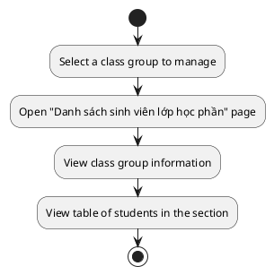
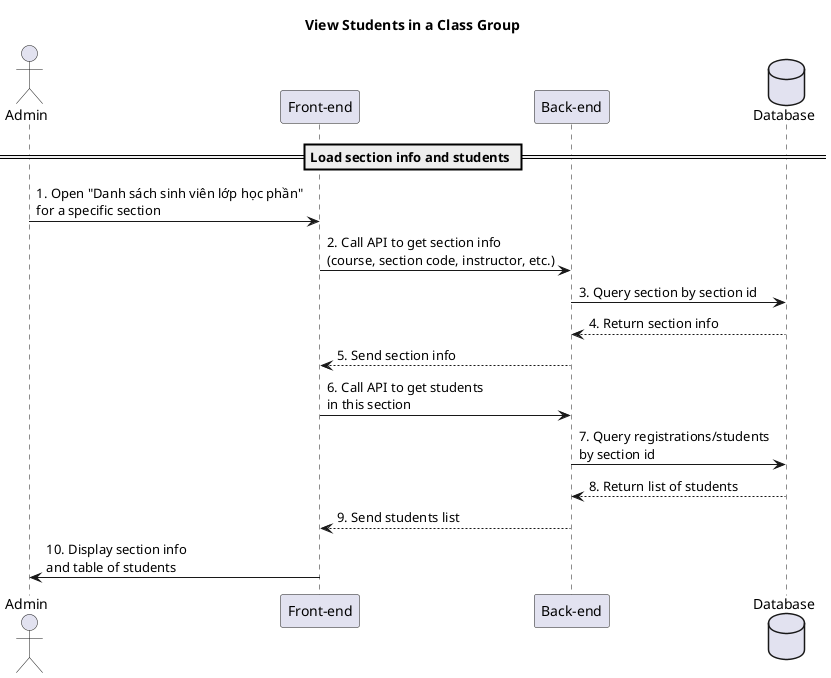

a) Actor:  
- User (admin).

b) Description:  
- This use case allows an admin to open a class group (course section) and view the list of students registered in that section.

c) Pre-conditions:  
- The admin is already logged into the system.  
- The admin has access to the course and class group management screens.  
- A specific section (class group) has been selected from the course detail page or another admin screen.  

d) Main event flow (view students in a section):  
1. The admin selects a class group (for example, from the course detail page) to view its students.  
2. The front-end navigates to the "Danh sách sinh viên lớp học phần" page for the selected section.  
3. The front-end calls the API to get basic information of the class group (course name/code, section code, instructor, capacity, status, semester, timetable).  
4. The front-end calls the API to get the list of students in the section.  
5. The back-end reads the section info and student registrations from the database and returns them.  
6. The front-end displays:  
   - The section information (course, section code, instructor, capacity, status, semester, timetable).  
   - The table of students with columns such as student code, full name, class, major, cohort year, semester and registration date.  
7. The admin reviews the list of students in the section.  
8. The use case ends when the admin finishes viewing the list (other actions like add/remove are handled in related flows).  

e) Branch flows / related actions:  

- **A1 – No students in section**  
  1. The API returns no students in the section.  
  2. The front-end shows the message "Chưa có sinh viên nào đăng ký lớp học phần này".  
  3. The admin may decide to add students (via another action on the same screen) or leave the page.  

- **A2 – Search/filter students in section**  
  1. The admin types a keyword (at least 2 characters) into the search input.  
  2. After debounce, the front-end updates the search keyword and reloads the list of students for the current section with that filter.  
  3. If no matching students are found, the system shows "Không tìm thấy sinh viên phù hợp với từ khóa.".  

- **A3 – Remove a student from the section**  
  1. The admin clicks the delete button (trash icon) on a student row.  
  2. A confirmation dialog is shown asking the admin to confirm removing this student from the section.  
  3. If the admin confirms, the front-end calls the API to delete the student registration from this section.  
  4. The back-end removes the registration record from the database and returns success.  
  5. The front-end shows a success toast "Đã xóa sinh viên khỏi lớp học phần" and refreshes the student list.  

- **A4 – Add a student to the section**  
  1. The admin clicks the "Thêm sinh viên" button.  
  2. A dialog opens asking the admin to choose a cohort and search for students by keyword (minimum 2 characters).  
  3. The admin selects a cohort and types a search keyword; the front-end calls the API to search students in that cohort.  
  4. The back-end searches students in the database and returns matching results.  
  5. The front-end shows the search results in a table where the admin can select one student.  
  6. The admin confirms adding the selected student to the section.  
  7. The front-end calls the API to register the student into the section.  
  8. The back-end creates the registration record and returns success.  
  9. The front-end shows a success toast "Đã thêm sinh viên vào lớp học phần", closes the dialog and refreshes the student list.  

f) Post-condition:  
- The admin has seen the list of students in the section and, where applicable, may have removed or added students.  
- The database and the displayed list remain consistent after any add/remove actions.  

=== activity diagram (view students in a class group)=====

=== activity diagram image====

=== sequence diagram (view students in a class group)====

=== sequence diagram image====

