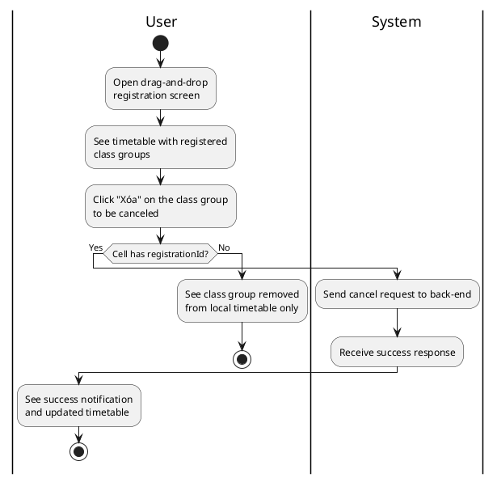
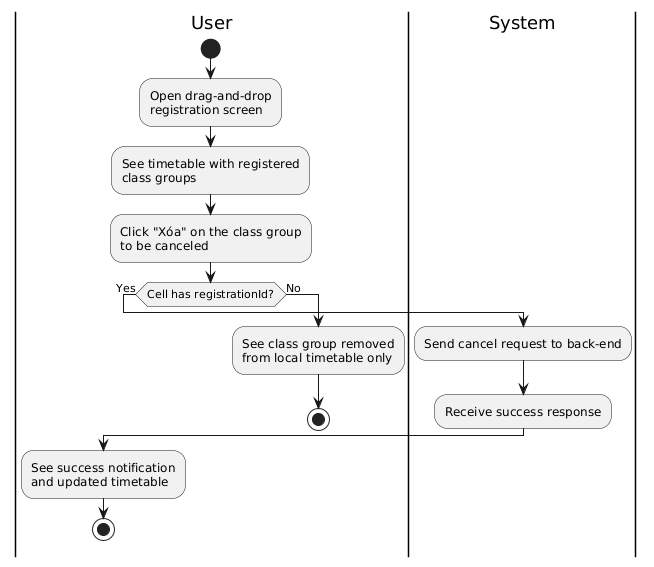
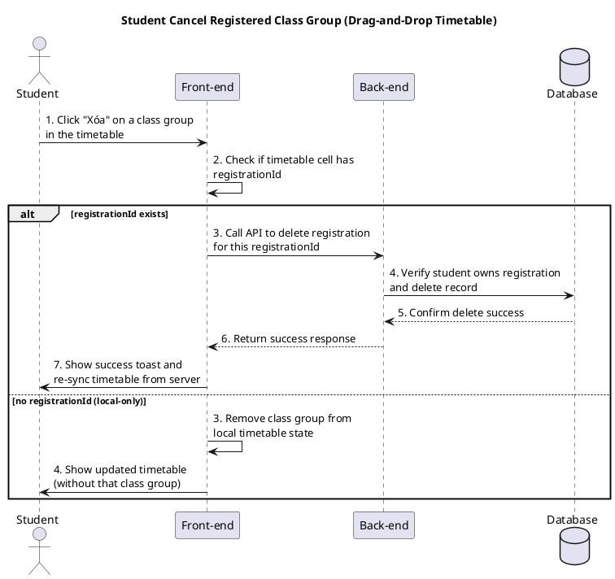
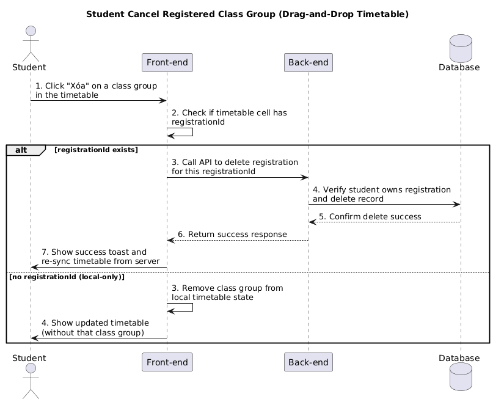

a) Actor:  
- User (student).

b) Description:  
- This use case allows a student to cancel one of their registered class groups (course sections) directly on the drag‑and‑drop timetable by clicking the "Xóa" button in the timetable cell.

c) Pre-conditions:  
- The student is already logged into the system.  
- The drag‑and‑drop credit registration screen is open and has loaded the student's current timetable from the server.  

d) Main event flow (student cancels a registered class group):  
1. The student opens the drag‑and‑drop registration screen ("Đăng ký với thời khóa biểu").  
2. The system shows the timetable grid with the student's current registered class groups (each subject displayed as a block across its periods).  
3. The student identifies the subject/class group they want to cancel in the timetable.  
4. The student clicks the **"Xóa"** button in the head cell of that subject's block.  
5. The front-end checks whether there is a valid `registrationId` for this class group in the timetable cell.  
6. If a `registrationId` exists, the front-end sends a request to the back-end to cancel this registration.  
7. The back-end verifies that this registration belongs to the logged-in student, deletes the registration from the database and returns success.  
8. The front-end shows a success toast (for example, "Đã xóa [tên môn học] khỏi thời khóa biểu").  
9. The front-end re-syncs the timetable from the server so that the canceled class group is no longer shown.  
10. The use case ends.  

e) Branch flows / conditions:  

- **A1 – No registrationId in timetable cell (local-only removal)**  
  1. The student clicks "Xóa" on a timetable cell that does not have a `registrationId` (for example, a locally added class without a server registration).  
  2. The front-end removes the subject block from the local timetable grid only.  
  3. The front-end updates the list of registered subjects in local state.  
  4. No API call is made in this fallback path.  

- **A2 – Back-end error when canceling registration**  
  1. The student clicks "Xóa" and the front-end sends a cancel request with a valid `registrationId`.  
  2. The back-end fails to delete the registration (for example, server error or rule violation).  
  3. The front-end shows an error toast such as "Không thể xóa lớp học phần".  
  4. The timetable remains unchanged; the student can try again later.  

f) Post-condition:  
- **Success**: the selected class group is removed from the student's timetable and its registration record is deleted from the database.  
- **Fallback/Failure**: in the fallback path (no `registrationId`) only the local timetable is changed; on a back-end error, no data is removed and the timetable stays the same.

=== activity diagram (student cancel registered class group)=====

=== activity diagram image====

=== sequence diagram (student cancel registered class group)====

=== sequence diagram image====

