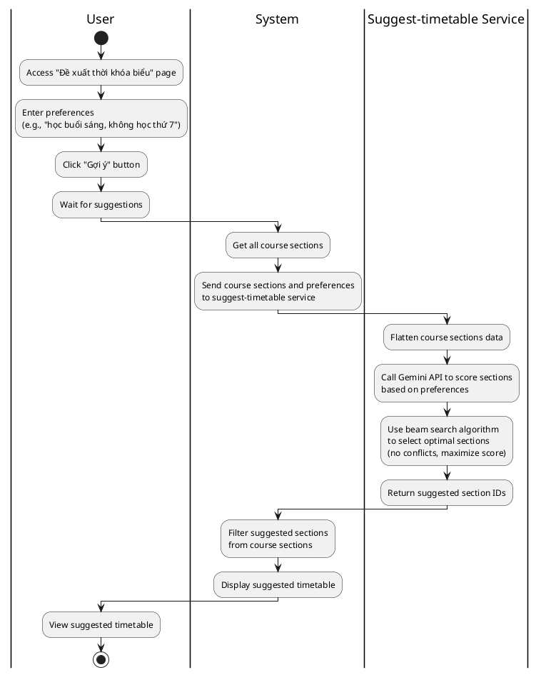
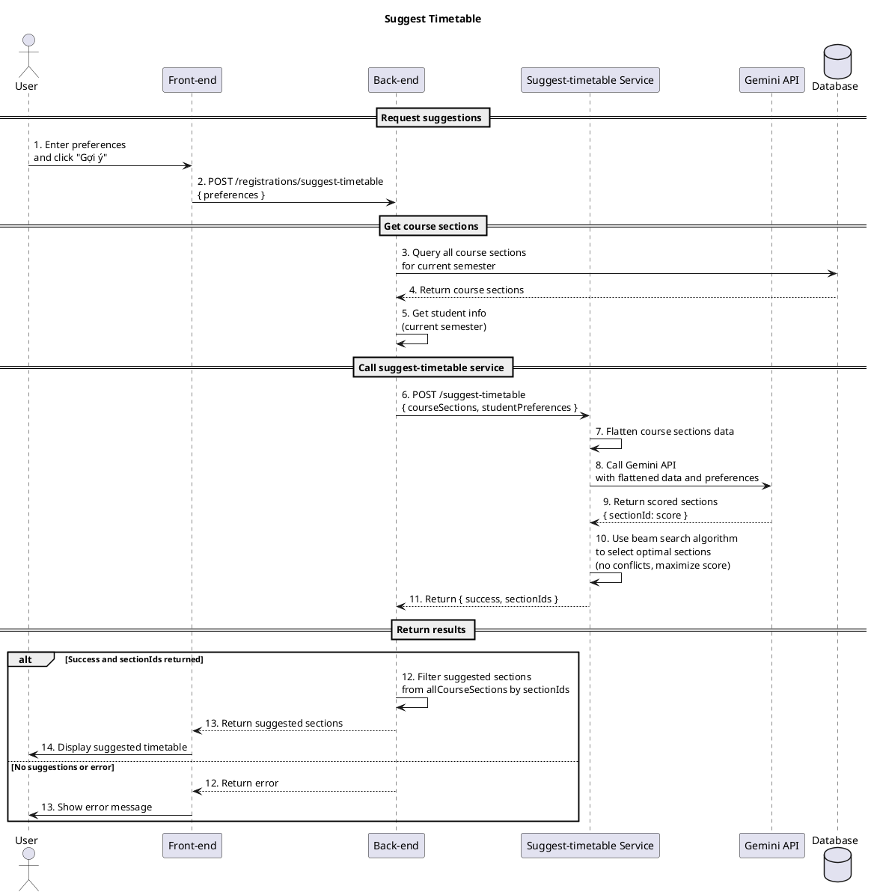

a) Actor:  
- User (student).

b) Description:  
- This use case allows the student to get AI-powered timetable suggestions based on their preferences. The system uses Gemini API to score course sections and beam search algorithm to select optimal sections without schedule conflicts.

c) Pre-conditions:  
- The student is already logged into the system.  
- There are available course sections in the current semester.

d) Main event flow:  
1. The student accesses the "Đề xuất thời khóa biểu" page.  
2. The student enters their preferences (e.g., "Tôi muốn học vào buổi sáng, không học thứ 7").  
3. The student clicks the "Gợi ý" button.  
4. The system sends course sections and preferences to the suggest-timetable service.  
5. The suggest-timetable service calls Gemini API to score all course sections based on preferences.  
6. The suggest-timetable service uses beam search algorithm to select optimal sections (no conflicts, maximize score).  
7. The system displays the suggested timetable with selected course sections.  
8. The use case ends.  

e) Branch flows / conditions:  

- **A1 – No suggestions returned**  
  1. The suggest-timetable service cannot generate suggestions (e.g., API error, no valid sections).  
  2. The system shows an error message like "Không thể tạo đề xuất thời khóa biểu".  
  3. No timetable is displayed.  

- **A2 – Suggest service unavailable**  
  1. The suggest-timetable service is not configured or unavailable.  
  2. The system shows an error message like "Suggest service URL not configured".  
  3. No timetable is displayed.  

f) Post-condition:  
- **Successful path**:  
  - The student has received AI-powered timetable suggestions displayed in a weekly schedule format.  
  - The suggested sections have no schedule conflicts and maximize preference satisfaction.  
- **Error/branch paths**:  
  - If any error occurs (A1–A2), the system shows an appropriate error message and no timetable is displayed.

=== activity diagram (suggest timetable)=====

=== activity diagram image====

=== sequence diagram (suggest timetable)====

=== sequence diagram image====

