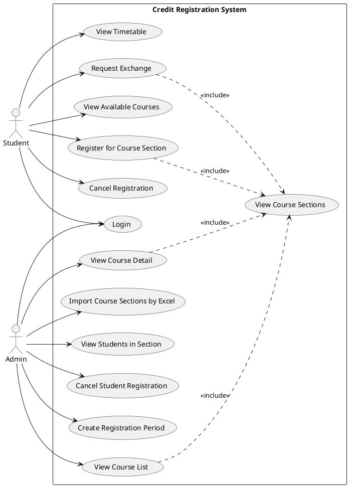

# Credit Registration System - System Overview

## Use Case Diagram



## Code Plan - System Architecture

### 1. Front-end Structure

```
front-end/
├── src/
│   ├── routes/
│   │   ├── auth/
│   │   │   └── login.tsx                    # Login use case
│   │   ├── student/
│   │   │   ├── available-courses.tsx        # View Available Courses
│   │   │   ├── credit-registration.tsx      # Register for Course Section
│   │   │   ├── cancel-registration.tsx      # Cancel Registration
│   │   │   ├── view-timetable.tsx           # View Timetable
│   │   │   └── exchange-request.tsx         # Request Exchange
│   │   └── admin/
│   │       ├── courses/
│   │       │   ├── course-list.tsx          # View Course List
│   │       │   └── course-detail.tsx        # View Course Detail
│   │       ├── course-sections/
│   │       │   ├── import-sections.tsx      # Import Course Sections by Excel
│   │       │   └── section-students.tsx     # View Students in Section
│   │       ├── registration-period.tsx      # Create Registration Period
│   │       └── cancel-student-registration.tsx # Cancel Student Registration
│   ├── components/
│   │   ├── course/
│   │   │   ├── CourseList.tsx               # Reusable course list component
│   │   │   ├── CourseDetail.tsx             # Reusable course detail component
│   │   │   └── CourseSections.tsx           # View Course Sections (shared)
│   │   ├── registration/
│   │   │   ├── RegistrationForm.tsx
│   │   │   └── TimetableGrid.tsx
│   │   └── exchange/
│   │       └── ExchangeRequestForm.tsx
│   └── features/
│       ├── auth/
│       │   └── login/
│       ├── course/
│       │   ├── view-course-sections/        # Shared feature
│       │   ├── view-course-list/
│       │   └── view-course-detail/
│       ├── registration/
│       │   ├── register-section/
│       │   ├── cancel-registration/
│       │   └── view-timetable/
│       └── exchange/
│           └── request-exchange/
```

### 2. Back-end Structure

```
backend/
├── src/
│   ├── module/
│   │   ├── auth/
│   │   │   ├── auth.controller.ts           # Login endpoint
│   │   │   ├── auth.service.ts
│   │   │   └── auth.module.ts
│   │   ├── user/
│   │   │   ├── student/
│   │   │   │   ├── student.controller.ts
│   │   │   │   ├── student.service.ts
│   │   │   │   └── student.repository.ts
│   │   │   └── admin/
│   │   │       ├── admin.controller.ts
│   │   │       └── admin.service.ts
│   │   ├── course/
│   │   │   ├── course.controller.ts         # View Course List, View Course Detail
│   │   │   ├── course.service.ts
│   │   │   ├── course.repository.ts
│   │   │   ├── course-section/
│   │   │   │   ├── course-section.controller.ts  # View Course Sections (shared)
│   │   │   │   ├── course-section.service.ts
│   │   │   │   ├── course-section.repository.ts
│   │   │   │   └── dto/
│   │   │   │       └── import-sections.dto.ts   # Import Course Sections by Excel
│   │   │   └── course.module.ts
│   │   ├── registration/
│   │   │   ├── registration.controller.ts   # Register, Cancel Registration
│   │   │   ├── registration.service.ts
│   │   │   ├── registration.repository.ts
│   │   │   └── registration-period/
│   │   │       ├── registration-period.controller.ts  # Create Registration Period
│   │   │       ├── registration-period.service.ts
│   │   │       └── registration-period.repository.ts
│   │   ├── exchange/
│   │   │   ├── exchange.controller.ts        # Request Exchange
│   │   │   ├── exchange.service.ts
│   │   │   └── exchange.repository.ts
│   │   └── timetable/
│   │       ├── timetable.controller.ts      # View Timetable
│   │       └── timetable.service.ts
│   └── common/
│       ├── guards/
│       │   ├── roles.guard.ts               # Student/Admin role guard
│       │   └── auth.guard.ts
│       └── decorators/
│           └── roles.decorator.ts
```

### 3. API Endpoints Mapping

#### Authentication
- `POST /auth/login` - Login (Student, Admin)

#### Student Endpoints
- `GET /courses/available` - View Available Courses
- `GET /course-sections/:courseId` - View Course Sections (shared, included)
- `POST /registrations` - Register for Course Section
- `DELETE /registrations/:registrationId` - Cancel Registration
- `GET /timetable` - View Timetable
- `POST /exchange/request` - Request Exchange
  - Includes: `GET /course-sections/:courseId` (View Course Sections)

#### Admin Endpoints
- `GET /admin/courses` - View Course List
  - Includes: `GET /course-sections/:courseId` (View Course Sections)
- `GET /admin/courses/:courseId` - View Course Detail
  - Includes: `GET /course-sections/:courseId` (View Course Sections)
- `POST /admin/course-sections/import` - Import Course Sections by Excel
- `GET /admin/course-sections/:sectionId/students` - View Students in Section
- `DELETE /admin/registrations/:registrationId` - Cancel Student Registration
- `POST /admin/registration-periods` - Create Registration Period

### 4. Shared Components & Services

#### View Course Sections (Shared Use Case)
- **Front-end**: `components/course/CourseSections.tsx`
- **Back-end**: `GET /course-sections/:courseId`
- **Service**: `course-section.service.ts::getSectionsByCourseId()`
- **Used by**:
  - Request Exchange
  - Register for Course Section
  - View Course List
  - View Course Detail

### 5. Database Schema (Key Entities)

```sql
-- Users
users (id, email, password, role, ...)
students (id, user_id, student_code, ...)
admins (id, user_id, ...)

-- Courses
courses (id, code, name, credits, ...)
course_sections (id, course_id, section_code, capacity, ...)
section_meetings (id, section_id, day_of_week, start_period, end_period, ...)

-- Registration
registrations (id, student_id, section_id, status, created_at, ...)
registration_periods (id, name, start_date, end_date, semester, ...)

-- Exchange
exchange_requests (id, student_id, from_section_id, to_section_id, status, ...)
```

### 6. Use Case Implementation Checklist

#### Student Use Cases
- [x] Login - `login.md`
- [ ] Request Exchange - `exchage-request.md` (cần kiểm tra)
- [x] View Available Courses - `available-courses.md`
- [x] Register for Course Section - `credit-registration.md`
- [ ] Cancel Registration - `student-cancel-registration.md` (cần kiểm tra)
- [x] View Timetable - `view-timetable.md`

#### Admin Use Cases
- [x] Login - `login.md`
- [ ] View Course List - `admin-courses.md` (cần kiểm tra)
- [ ] View Course Detail - `course-detail.md` (cần kiểm tra)
- [ ] Import Course Sections by Excel - `import-course-sections.md` (cần kiểm tra)
- [ ] View Students in Section - `section-students.md` (cần kiểm tra)
- [x] Cancel Student Registration - `admin-cancel-registration.md`
- [ ] Create Registration Period - `create-registration-period.md` (cần kiểm tra)

#### Shared Use Cases
- [x] View Course Sections - `course-sections.md`

### 7. Dependencies & Relationships

#### Include Relationships
1. **Request Exchange** includes **View Course Sections**
   - Student needs to see sections before requesting exchange
   
2. **Register for Course Section** includes **View Course Sections**
   - Student needs to see sections before registering
   
3. **View Course List** includes **View Course Sections**
   - Admin views sections when browsing courses
   
4. **View Course Detail** includes **View Course Sections**
   - Admin views sections when viewing course details

### 8. Security & Authorization

- **Authentication**: JWT tokens (Firebase Auth)
- **Authorization**:
  - Student role: Can access student endpoints only
  - Admin role: Can access admin endpoints only
  - Guards: `@UseGuards(AuthGuard, RolesGuard)`
  - Decorators: `@Roles('student')`, `@Roles('admin')`

### 9. Key Business Rules

1. **Registration Period**: Students can only register during active periods
2. **Capacity Check**: Cannot register if section is full
3. **Time Conflict**: Cannot register if schedule conflicts with existing registrations
4. **Prerequisites**: Must meet course prerequisites before registration
5. **Exchange**: Can only exchange within same course and during exchange period

