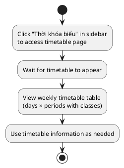
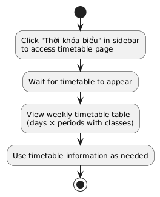
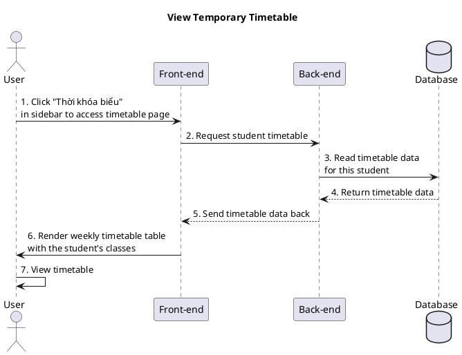
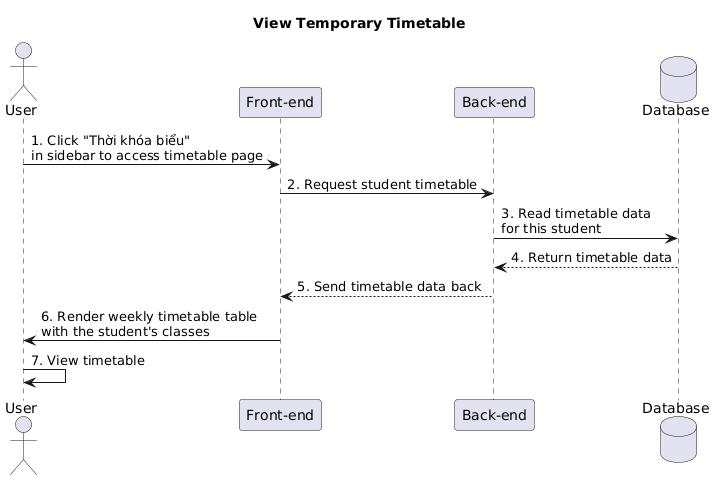

a) Actor:  
- User (student).

b) Description:  
- This use case allows the student to access the "Thời khóa biểu" page and see their weekly schedule that the system returns from the database.

c) Pre-conditions:  
- The student is already logged into the system.  

d) Main event flow:  
1. The student clicks on the "Thời khóa biểu" item in the sidebar to access the timetable page.  
2. The front-end opens the "Thời khóa biểu" page and sends a request to the back-end to get the student's schedule.  
3. The back-end reads the timetable data for this student from the database.  
4. The back-end returns the timetable data to the front-end.  
5. The front-end displays the weekly timetable table (days × periods) with the student's registered classes.  
6. The student views the timetable and remembers/uses it as needed.  
7. The use case ends.  

e) Branch flow A1 – No special branches:  
- In this simplified flow we assume the request succeeds and data is returned normally.  

f) Post-condition:  
- The student has seen the temporary timetable that reflects their current registered classes.

=== activity diagram (view temporary timetable)=====

=== activity diagram image====

=== sequence diagram (view temporary timetable)====

=== sequence diagram image====

